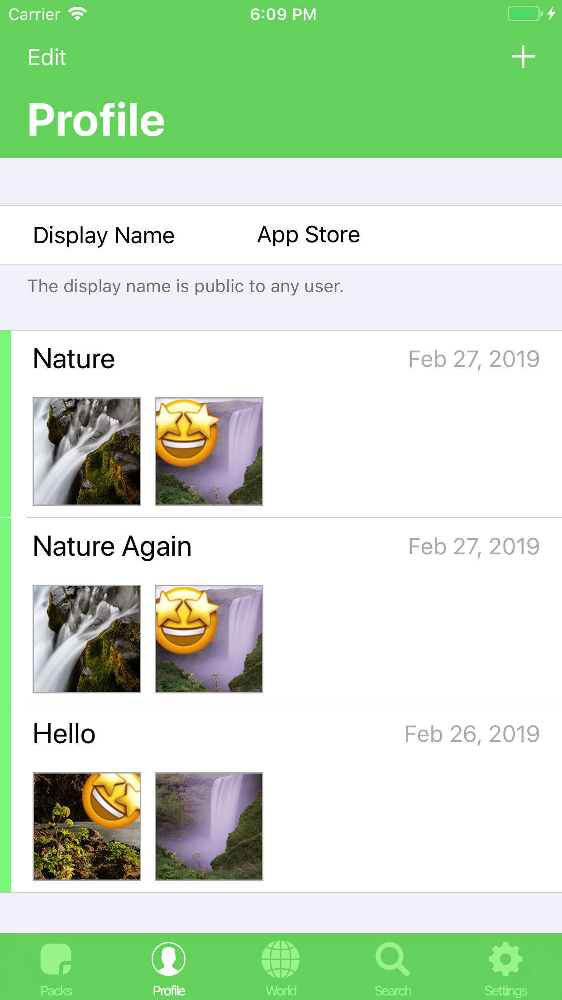
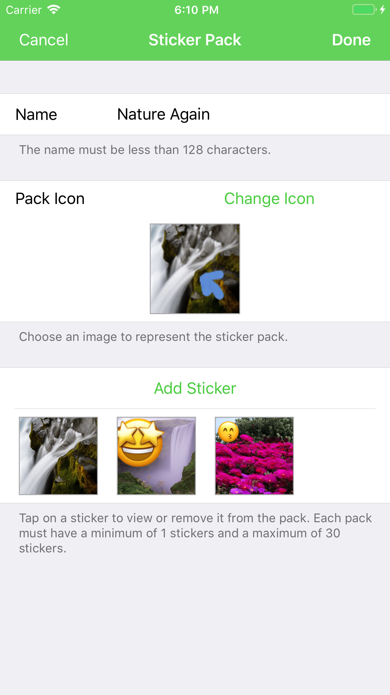
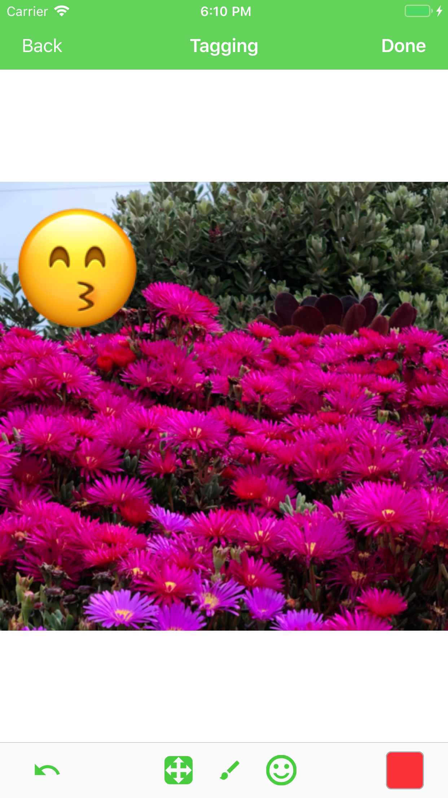
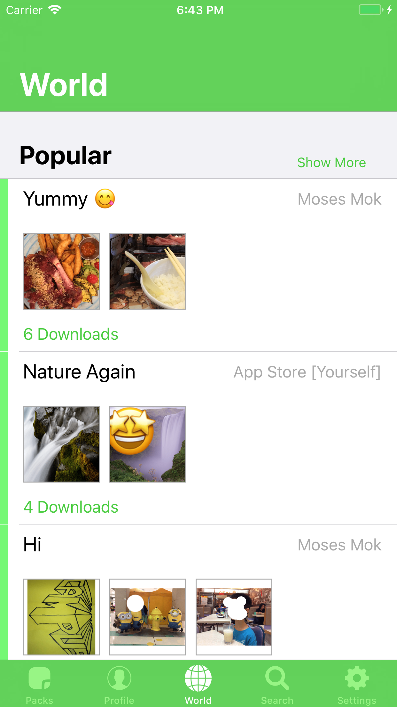

# MoSticker
An iOS app to create, manage and share WhatsApp stickers.

⚠️ This project is no longer maintained.
It was originally designed for iOS 11, so work needs to be done to build it for the lastest iOS version.

## Features
- Create sticker packs to be used in WhatsApp.
- Built-in tools for cropping images, adding emojis, drawing, and background removal.
- Log in and publish your sticker packs for others to see and download.

## Technical Details
- Functionality of exporting sticker packs to WhatsApp is taken from [the official WhatsApp repo](https://github.com/WhatsApp/stickers).
- PNG compression is done using [pngquant](https://pngquant.org/).
- Conversion of PNG images to WebP is done using [cwebp](https://developers.google.com/speed/webp/docs/cwebp).
- Phone, email, and Google sign-in authentication methods are provided by [Firebase Authentication](https://firebase.google.com/docs/auth).
- Published sticker packs and user data are stored on [Cloud Firestore](https://firebase.google.com/docs/firestore).
See the database schema [here](firebase_firestore/rules.rules).
- Backend logic is run on [Cloud Functions for Firebase](https://firebase.google.com/docs/functions).

Three attempts were made to publish this app on the Apple App Store in early 2019,
but it was unfortunately rejected by Apple as they thought it was similar to other existing apps.
